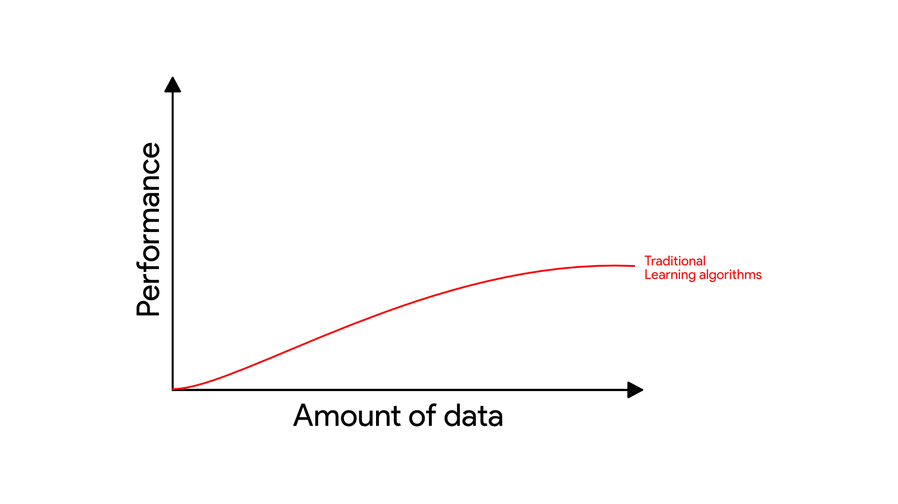
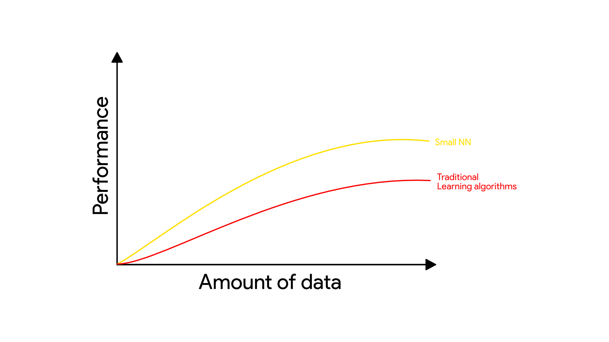
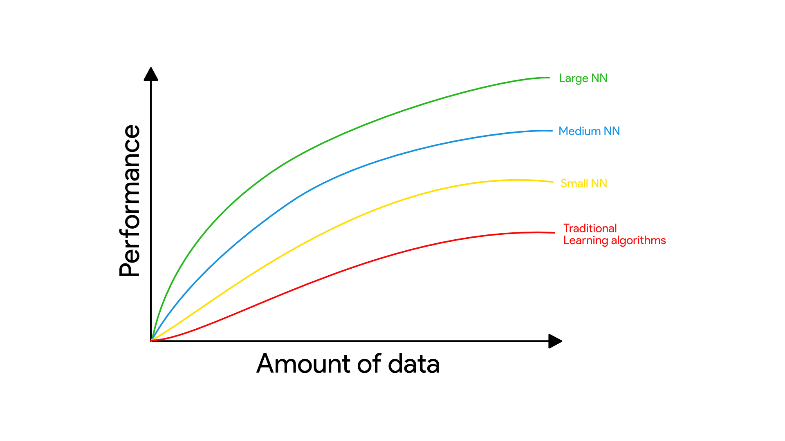

# Scale drives machine learning progress
->

Many of the ideas of deep learning (neural networks) have been around for decades. Why are these ideas taking off now?
->

Two of the biggest drivers of recent progress have been:
->

* **Data availability.​** People are now spending more time on digital devices (laptops, mobile devices). Their digital activities generate huge amounts of data that we can feed to our learning algorithms.
->

* **Computational scale.** ​We started just a few years ago to be able to train neural networks that are big enough to take advantage of the huge datasets we now have.
->

In detail, even as you accumulate more data, usually the performance of older learning algorithms, such as logistic regression, “plateaus.” This means its learning curve “flattens out,” and the algorithm stops improving even as you give it more data:
->

It was as if the older algorithms didn’t know what to do with all the data we now have.
->

If you train a small neutral network (NN) on the same supervised learning task, you might get slightly better performance:
->

Here, by “Small NN” we mean a neural network with only a small number of hidden units/layers/parameters. Finally, if you train larger and larger neural networks, you can obtain even better performance [1]:
->

Thus, you obtain the best performance when you (i) Train a very large neural network, so that you are on the green curve above; (ii) Have a huge amount of data.
->

Many other details such as neural network architecture are also important, and there has been much innovation here. But one of the more reliable ways to improve an algorithm’s performance today is still to (i) train a bigger network and (ii) get more data.
->

**FOOTNOTE:**

[1] This diagram shows NNs doing better in the regime of small datasets. This effect is less consistent than the effect of NNs doing well in the regime of huge datasets. In the small data regime, depending on how the features are hand-engineered, traditional algorithms may or may not do better. For example, if you have 20 training examples, it might not matter much whether you use logistic regression or a neural network; the hand-engineering of features will have a bigger effect than the choice of algorithm. But if you have 1 million examples, I would favor the neural network.
->

The process of how to accomplish (i) and (ii) are surprisingly complex. This book will discuss the details at length. We will start with general strategies that are useful for both traditional learning algorithms and neural networks, and build up to the most modern strategies for building deep learning systems.
->